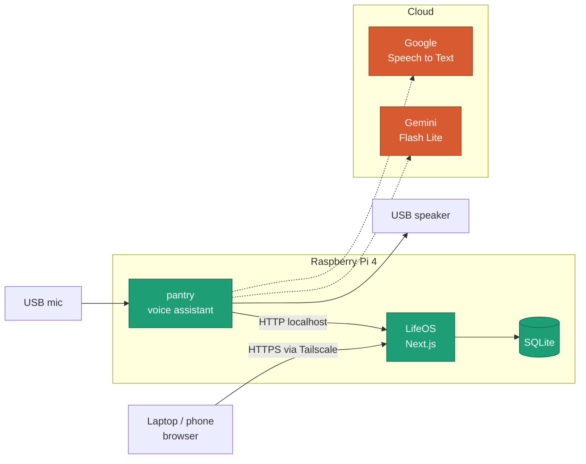
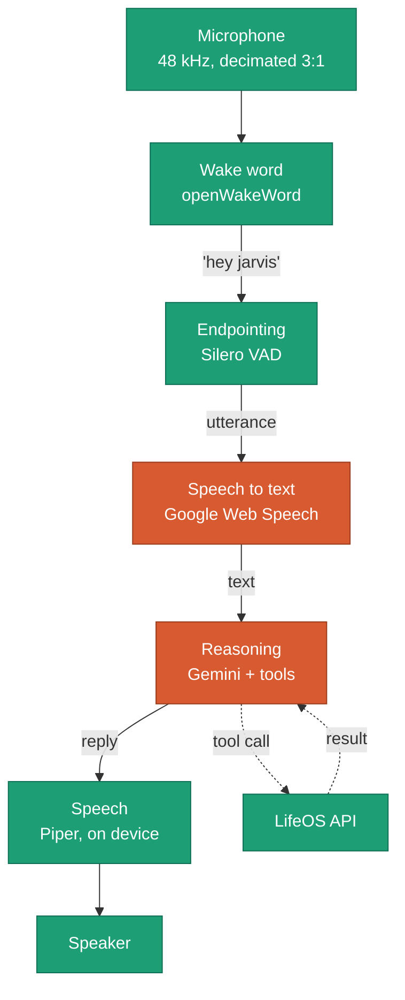
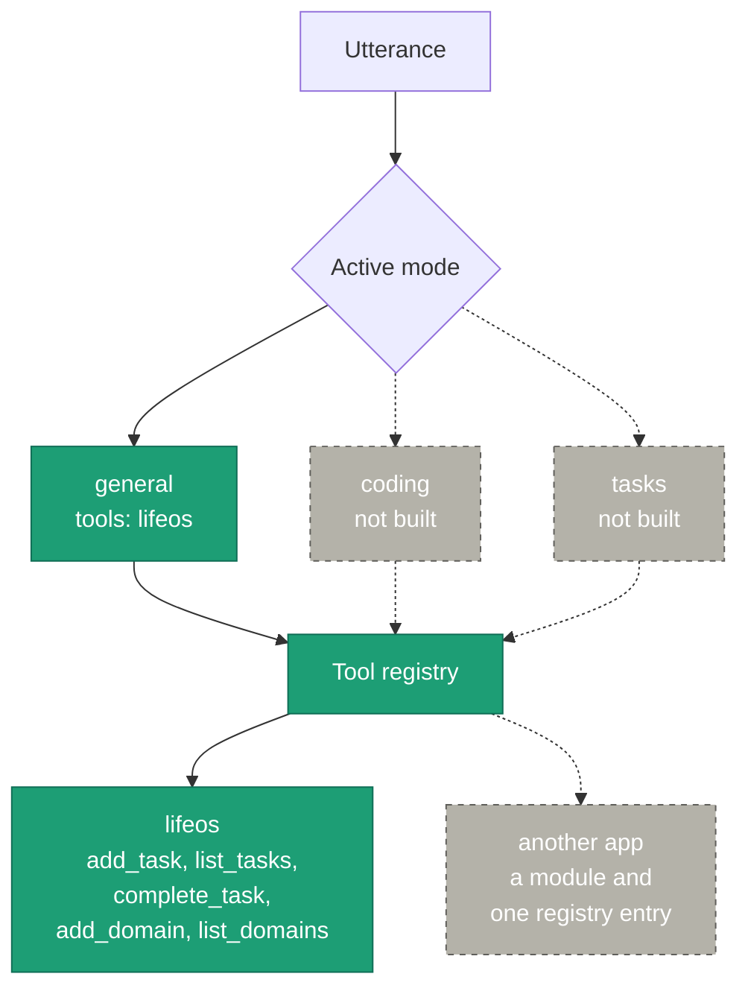
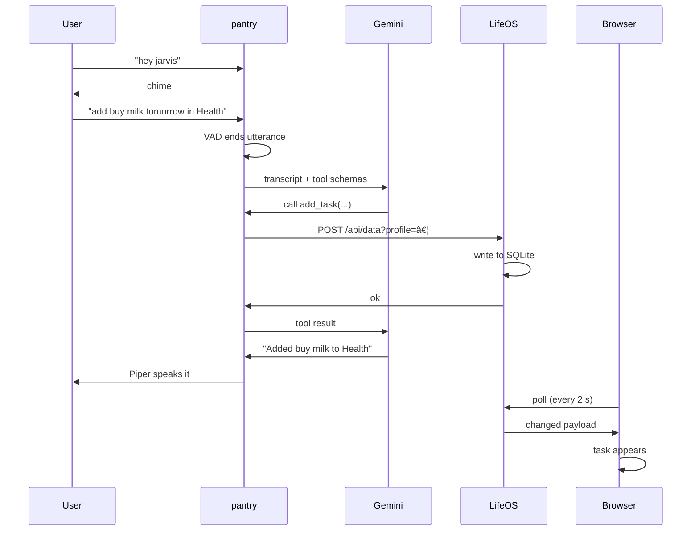

# Architecture

pantry is a voice front end that dispatches to applications. It runs on a
Raspberry Pi 4 alongside the apps it drives.

The design goal is that adding a second application is a new module and one
registry entry, and the voice loop never changes.

## System

Solid lines stay on the device or the local network. Dashed lines leave it.
Two of the five pipeline stages are still remote; the rest run on the Pi.

## Voice pipeline

Measured on the Pi:

| Stage | Time |
|---|---|
| Wake word | ~0.1 s, 0.000 idle vs 0.96+ on detection |
| Endpointing | 700 ms of silence ends an utterance |
| Speech to text | 0.3–0.6 s |
| Gemini | 0.5–2 s healthy, 10–25 s when degraded |
| Piper | 0.32 × realtime |

The microphone rejects 16 kHz, so audio is captured at 48 kHz and decimated
with an anti-aliasing filter. Without one, everything above 8 kHz folds back
into the speech band, and the microphone's noise is broadband.

## Modes and tools

A mode is scoped context: a system prompt plus which application toolsets are
in scope. Identity — whose data a tool touches — is a separate axis, so
`add_task` is written once and works for any profile.

Tools are plain Python functions. Their type hints become the parameter
schema and their docstrings tell the model when to call them, so the wording
of a docstring is functional code.

## Adding a task by voice

The browser learns about the change by polling rather than being pushed to.
A dropped stream needs reconnect and backoff logic; an unchanged poll is one
request whose body matches the last one, so it costs a round trip and
nothing else.

## Choices worth explaining

**Wake word on device.** The prototype detected the wake word by sending
four second chunks of room audio to Google continuously. openWakeWord runs
locally, so the microphone stays on the Pi until the wake word fires.

**Piper over a cloud voice.** Removes a network call from every reply, and
the demo does not depend on a speech service being healthy. The `high`
quality models sound better but synthesise at roughly 2× slower than
realtime on a Pi 4, which stalls every reply — so `medium` with the
expressiveness parameters raised is the usable tier.

**Whole replies, not streamed.** Streaming emits `function_call` parts with
no text, which stalls a text-only consumer; Google's SDK advisory puts
automatic function calling on `send_message`. Streaming saved a fraction of
a second and cost the reliability of the whole tool path.

**Registry keyed by application.** A flat list of tools would work today
with one app. Keyed by app, a mode can scope which sets are live, which is
what keeps the model from choosing among every function ever registered.

## Not built yet

Local speech to text (whisper.cpp is workable on this hardware but ~3 s),
a local language model, a second application toolset, speaker identification
for per-person profiles, and barge-in.
